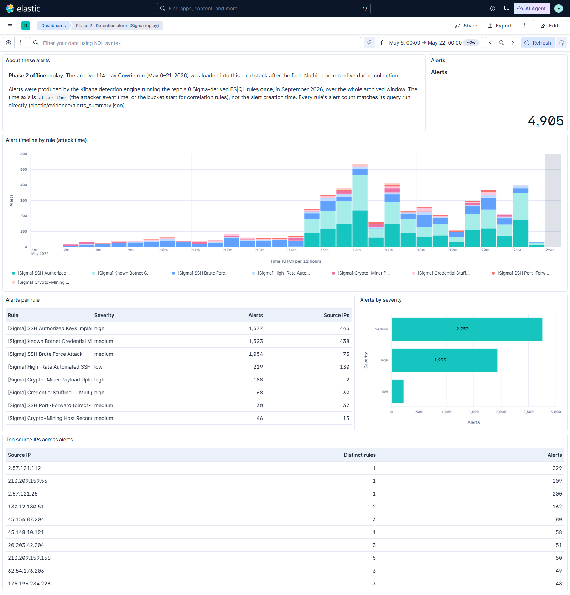

# SOC Detection Lab — Honeypot Visualizer Dashboard

**Live dashboard:** https://dashboard.dram-soc.org · **Portfolio:** https://dram-soc.org · **Partner project:** [Diamond IQ](https://diamond-iq.dram-soc.org) ([repo](https://github.com/dram64/diamond-iq))

A serverless AWS-native pipeline that ingested live SSH attacker telemetry from a Cowrie honeypot over a 14-day collection run (May 6–21, 2026), correlated the captured sessions to their real source IPs through a reverse-tunnel architecture, enriched with GeoIP, and renders the result on a React dashboard. **The edge sensor has since been decommissioned; the AWS pipeline and dashboard remain live**, now presenting the completed run as a permanent record.

**Phase 2 (September 2026): offline detection & analysis.** After the run ended, the archived dataset was replayed into a local Elasticsearch + Kibana stack. The repo's Sigma rules were deployed as Kibana detection rules against it, and the resulting alerts were triaged into analyst write-ups. This was an after-the-fact analysis of the archived data; **no SIEM was running during collection.** See [Phase 2](#phase-2--offline-detection--analysis-of-the-archived-run).

## What this is

A production system for collecting, processing, and visualizing live SSH attacker traffic. Over a 14-day run, real attackers from the public internet probed a Cowrie honeypot and the captured attempts (commands, credentials, session metadata) flowed through:

- **Edge** — Raspberry Pi 5 hosting Cowrie SSH/Telnet honeypot, with a DigitalOcean droplet hosting HAProxy as the public ingress. `autossh` holds a persistent reverse SSH tunnel between them so the Pi never has a port forwarded from a residential ISP.
- **Log shipping** — `fluent-bit` on both edge hosts ships JSON logs to S3 with filesystem-backed buffering (1 GB cap, 1-min/8-MB batches, gzip + NDJSON) and per-host IAM scoping.
- **Correlation** — A timestamp-window join in Lambda matches each Cowrie session (which sees `127.0.0.1` because of the reverse tunnel) to the originating HAProxy connection log line, recovering the real source IP. Enriches with MaxMind GeoLite2 Country + ASN.
- **Storage** — Single-table DynamoDB design (per ADR-003) with TTL on raw events and aggregate counters under separate prefixes.
- **API + UI** — API Gateway HTTP API + Lambda + a React SPA on CloudFront at https://dashboard.dram-soc.org.
- **Observability** — CloudWatch metric filters + alarms on the ingest Lambda's log group; SNS topic (`-edge-alarms`) for alerting from CloudWatch alarms (`-cowrie-heartbeat-missing`, `-haproxy-heartbeat-missing` — 15-min window, `treat_missing_data: breaching`).
- **CI/CD** — GitHub Actions OIDC trust assumes a scoped IAM role (`dram-soc-github-deploy`) for `terraform apply` + Lambda code deploy. ADR-011 formalizes the human-vs-CI permission boundary so the deploy role explicitly cannot mint AWS access keys.

## Collection results (14-day run · May 6–21, 2026)

| Metric | Value |
|---|---|
| Events captured | 231,930 |
| Attack sessions | 36,440 |
| SSH login attempts | 36,405 |
| Commands executed | 16,180 |
| Unique attacker IPs | 1,322 |
| Source countries | 83 † |
| Uploaded payloads (SCP/SFTP) | 16 distinct SHA-256: RedTail builds, their installer scripts, and `sshd` / `xinetd` replacements ‡ |

‡ Previously reported as "20 distinct malware payloads". The other 4 hashes are Cowrie hashing shell-redirect writes (`authorized_keys` ×2, `/etc/hosts.deny`, `/tmp/.config`), not malware. The 16 are identified by file name and SHA-256 only; no binary was analysed, so family names are inferred.

† Previously reported as 84. The ip-api.com lookup output for all 1,322 ingress IPs lists 85 country labels, including two duplicate pairs ("Netherlands" / "The Netherlands", "Turkey" / "Türkiye"), which makes 83 distinct countries. The Phase 2 replay, using MaxMind GeoLite2 on the 1,287 IPs that can be tied to Cowrie sessions, finds 80. Details in [elastic/README.md](elastic/README.md#source-ip-attribution).

Captured live botnet activity: a botnet credential marker (`345gs5662d34`), SSH-key implant persistence, a RedTail cryptominer kit plus miner reconnaissance, and automated Go/libssh scanners. (Earlier versions of this README called `345gs5662d34` a "Mirai" marker. The Phase 2 analysis found no support for that in this SSH-only dataset: it is a step of the SSH-key implant campaign. See [INV-01](docs/investigations/01-botnet-credential-marker.md).) Top source countries by volume: Netherlands, Uzbekistan, United States, Hong Kong, Germany. The dashboard at https://dashboard.dram-soc.org presents this dataset. The raw events were shipped to S3 under a lifecycle rule that expires `raw/` objects after 90 days (`modules/ingest/main.tf`), so the S3 copy of this run has aged out by design. A complete local copy of the archive (231,930 events) is what Phase 2 replayed. A SHA-256 manifest of the captured payloads is kept under `s3://dram-soc-honeypot-ingest/captured-samples/`. A zip of the payload files themselves, uploaded at decommission, contradicted ADR-009; it was permanently deleted, all versions, on 2026-09-19, and only the manifest remains.

## Phase 2 — offline detection & analysis of the archived run

Built in September 2026, after decommissioning. It runs locally only (Docker, every port bound to `127.0.0.1`), costs nothing, and exposes nothing. The honeypot run itself is unchanged: 14 days, May 6–21, 2026.

| Step | What was done | Where |
|---|---|---|
| Stack | Single-node Elasticsearch + Kibana 9.5.4 (security on, loopback-only) via docker-compose | [elastic/](elastic/) |
| Ingest | All 231,930 archived events replayed into ES with an ECS-aligned mapping. Source IPs rebuilt offline with the same HAProxy timestamp-window join as the ingest Lambda (34,956 / 36,440 sessions attributed, 95.9%). ADR-005 password filtering and the ADR-009 no-binaries policy are enforced before indexing. | [elastic/soc_elastic/](elastic/soc_elastic/) |
| Rules | 8 Sigma rules (2 original + 6 new, written against observed events) converted with pySigma to ES\|QL, Sigma correlations included, and loaded into the Kibana detection engine with ATT&CK (v19.2) mappings | [sigma/](sigma/), [elastic/detection-rules/](elastic/detection-rules/) |
| Replay | Each rule executed once over the archived window: **4,905 alerts, and every rule's alert count matches its query run directly against the index** | [elastic/evidence/](elastic/evidence/) |
| Analysis | 4 investigation write-ups: evidence, ATT&CK, severity call, Tier-1 next steps | [docs/investigations/](docs/investigations/) |
| Dashboards | Attacker origin (geo + ASN), credentials & commands, payload hashes, alert timeline; exported as Kibana NDJSON | [elastic/kibana/saved_objects/](elastic/kibana/saved_objects/) |

| Rule | ATT&CK | Alerts |
|---|---|---|
| SSH authorized_keys implant | T1098.004, T1222.002 | 1,577 |
| Botnet credential marker `345gs5662d34` | T1110.001 | 1,523 |
| SSH brute force (correlation) | T1110.001 | 1,054 |
| High-rate automated SSH scanner (correlation) | T1595 | 219 |
| Crypto-miner payload upload (RedTail) | T1105, T1496.001 | 188 |
| Credential stuffing (correlation) | T1110.004 | 168 |
| SSH port-forward (direct-tcpip) request | T1090 | 130 |
| Crypto-mining host recon | T1057, T1082 | 46 |

Three earlier Sigma rules need Suricata, MISP or Zeek data that this lab never had. They're kept, clearly marked, in [sigma/rules/not-deployed/](sigma/rules/not-deployed/) and weren't deployed.



## Architecture

```
                Internet (real attackers)
                        │
                        ▼
       ┌──────────────────────────────────────┐
       │  Cloudflare proxied DNS (edge WAF)   │
       │  ADR-007: free WAF, no AWS WAF       │
       └────────────────┬─────────────────────┘
                        │
                ┌───────▼────────┐
                │  DigitalOcean  │
                │  droplet :22   │
                │  HAProxy       │
                │  (public SSH)  │
                └───────┬────────┘
                        │ reverse SSH tunnel
                        │ (autossh, Pi-initiated)
                        ▼
                ┌────────────────┐
                │  Raspberry Pi  │
                │  Cowrie SSH    │
                │  honeypot      │
                └───────┬────────┘
                        │
   ┌────────────────────┴────────────────────┐
   │  fluent-bit on Pi: cowrie.json          │
   │  fluent-bit on droplet: haproxy.log     │
   └────────────────┬────────────────────────┘
                    │ S3 PutObject (per-prefix scoped IAM)
                    ▼
       ┌───────────────────────────┐
       │  AWS pipeline             │
       │                           │
       │  S3  →  Ingest Lambda     │
       │   (bidirectional          │
       │    timestamp-window       │
       │    correlation +          │
       │    MaxMind GeoLite2)      │
       │           ↓               │
       │  DynamoDB (single table)  │
       │           ↓               │
       │  Aggregator Lambda        │
       │  (DDB Streams +           │
       │   EventBridge crons)      │
       │           ↓               │
       │  API Lambda + API Gateway │
       │           ↓               │
       │  CloudFront + ACM         │
       │           ↓               │
       │  React SPA                │
       └───────────────────────────┘
                    ▼
          dashboard.dram-soc.org
```

## Live verification

End-to-end correlation has been verified against real attacker traffic:

- The reverse-tunnel + correlation rewrites the Cowrie-side `127.0.0.1` source IP back to the originating internet IP via the HAProxy log line and a 500ms timestamp window. (Originally 200ms; widened after measuring real-traffic handshake-completion latency clustering at 234–275ms — see ADR-010 §"Empirical window-tuning".) Verified end-to-end against test session `ddc63aaac987` (real source IP `104.174.33.78`, AS20001 Charter Communications, US).
- Real-data-driven schema relaxation in `cowrie_schema.py` (`extra="forbid"` → `extra="ignore"`) caught Cowrie 2.x per-version field churn that the synthetic-data path didn't surface (Phase 11A; `cowrie.client.kex` validation errors dropped from 48/hr to 0 within 3 minutes of deploy; first `command` aggregator item — `uname` — appeared within 2 minutes from a real attacker).
- 10 sanitized real-attacker fixtures (one per observed eventid) committed to the test suite under `dashboard/tests/backend/fixtures/real_data/`. `sanitize_for_fixture()` enforces public-repo publishable rules per ADR-005: `password_raw` strip, RFC 5737 doc-IP swap for the maintainer's home IP, geo-zero on country/asn fields. Real attacker IPs are preserved (already public via passive-DNS / threat-intel feeds).

## Tech stack (real, deployed)

| Layer | Components |
|---|---|
| Edge — honeypot | Cowrie SSH/Telnet honeypot (Pi 5) |
| Edge — networking | HAProxy on DigitalOcean droplet, autossh reverse SSH tunnel from Pi |
| Edge — log shipping | fluent-bit on both edges, filesystem-backed buffer (1 GB), gzip+NDJSON, 1-min/8-MB batches |
| AWS — compute | Lambda (3 functions: ingest, aggregator, api) on Python 3.13 |
| AWS — storage | DynamoDB (single-table per ADR-003) + S3 + S3 Versioning |
| AWS — edge / TLS | CloudFront + ACM (custom domain at dashboard.dram-soc.org, apex at dram-soc.org) |
| AWS — API | API Gateway HTTP API |
| AWS — schedules | EventBridge (daily summary, today summary, rank rebuild crons) |
| AWS — secrets | SSM Parameter Store SecureString for MaxMind license |
| AWS — observability | CloudWatch metric filters + alarms + SNS |
| AWS — IAM | OIDC-trusted GitHub Actions deploy role with ADR-011 permission boundary |
| Edge proxy / WAF | Cloudflare proxied DNS (per ADR-007 — no AWS WAF) |
| GeoIP enrichment | MaxMind GeoLite2 Country + ASN (Lambda layer) |
| IaC | Terraform (modular, separate state for human-managed credentials per ADR-011) |
| Frontend | React 18 + Vite + TypeScript + TanStack Query + Tailwind + Recharts (per ADR-004) |
| CI/CD | GitHub Actions: pytest (262 dashboard tests + 66 Phase 2 tests), ruff lint+format, terraform validate matrix, tflint, terraform-plan-on-PR, OIDC apply on workflow_dispatch, gitleaks, tfsec, Sigma validate + convert |
| Detection & analysis (Phase 2, local, offline replay of the archived run) | Elasticsearch + Kibana 9.5.4 (docker-compose, loopback-only); Python replay loader (offline HAProxy↔Cowrie IP attribution, ECS mapping, ADR-005/009 enforced); 8 Sigma rules → ES\|QL detection rules via pySigma with ATT&CK mappings; 4 Kibana dashboards |

## Architecture decision records

Nine ADRs documenting the trade-offs that shaped the design:

| ADR | Decision |
|---|---|
| [001](dashboard/docs/adr/001-data-schema.md) | Cowrie event schema as the canonical data model |
| [002](dashboard/docs/adr/002-log-shipping.md) | Pi → S3 PutObject → Lambda for log shipping |
| [003](dashboard/docs/adr/003-single-table-design.md) | DynamoDB single-table design |
| [004](dashboard/docs/adr/004-frontend-stack.md) | Frontend stack: React 18 + Vite + TS + TanStack Query + Tailwind |
| [005](dashboard/docs/adr/005-password-filtering.md) | Attempted-password dictionary filtering (`<filtered:len=N>` for non-dictionary values) |
| [007](dashboard/docs/adr/007-cloudflare-waf-over-aws-waf.md) | Cloudflare proxied DNS as edge WAF (no AWS WAF) |
| [009](dashboard/docs/adr/009-captured-malware-policy.md) | Captured-malware policy: SHA + URL only, no binary retention |
| [010](dashboard/docs/adr/010-fluent-bit-edge-shippers.md) | fluent-bit on Pi + droplet, timestamp-window correlation (supersedes part of ADR-002) |
| [011](dashboard/docs/adr/011-cicd-permission-boundary.md) | CI/CD permission boundary: human-managed credentials are separate from CI-managed infrastructure |

## CI / CD

Seven workflows in [.github/workflows/](.github/workflows/):

- **`dashboard-ci.yml`** — pytest (262 backend tests), ruff lint + format-check, terraform validate (matrix on `environments/dev` + `stacks/edge-shippers-credentials`), tflint. Runs on every PR + push to main under `dashboard/**`.
- **`dashboard-tf-plan.yml`** — On PRs touching `dashboard/infrastructure/**`: OIDC-assumes the deploy role, runs `terraform plan`, posts the output as a PR comment.
- **`dashboard-backend-deploy.yml`** — `workflow_dispatch` only (the auto-trigger flip lands after 5+ clean manual deploys per the Phase 11B-1 design). Builds Lambda zips + GeoIP layer, runs `terraform apply`.
- **`dashboard-frontend-deploy.yml`** — Auto-fires on `dashboard/web/**` changes pushed to main. Vite build, S3 sync (with `--delete`), CloudFront invalidation. The API endpoint is resolved at deploy time via `aws apigatewayv2 get-apis --query "Items[?Name=='dram-soc-api'].ApiEndpoint"` rather than hardcoded — survives API-recreation events.
- **`security-scan.yml`** — gitleaks (secret scanning) + tfsec (IaC) + yamllint + shellcheck. Runs on every PR + push to main, no path filter.
- **`sigma-validate.yml`**: `sigma check` on all 11 Sigma rules (8 deployable + 3 not deployed), then converts the 8 deployable rules to ES|QL through the Cowrie→ECS pipeline (pinned sigma-cli/pySigma versions).
- **`detection-ci.yml`**: Phase 2 tooling (`elastic/soc_elastic`): ruff lint + format check, and pytest (66 tests) with a 90% coverage gate.

## Repository layout

```
soc-detection-lab-honeypot/
├── README.md                           # You are here
├── LICENSE                             # MIT
├── dashboard/                          # The deployed, working system
│   ├── functions/                      #   Lambda source: ingest, aggregator, api, shared
│   ├── infrastructure/terraform/       #   IaC (modules + environments/dev + stacks)
│   ├── web/                            #   React SPA (live at dashboard.dram-soc.org)
│   ├── tests/backend/                  #   262 pytest tests
│   ├── scripts/                        #   package_lambdas.py, dictionary build, frontend deploy
│   ├── tools/                          #   Synthetic data generator (used by tests)
│   ├── edge/                           #   fluent-bit configs + HAProxy snippet for Pi/droplet
│   └── docs/                           #   9 ADRs + 11 phase logs + runbooks + PROJECT_PLAN.md
├── elastic/                            # Phase 2: local ES + Kibana stack, replay loader,
│                                       #   rule deployer, dashboards, evidence (offline)
├── sigma/                              # 8 deployed Cowrie rules + Cowrie→ECS pipeline;
│                                       #   3 not-deployed network rules (no data source)
├── docs/investigations/                # Phase 2 analyst write-ups (INV-01 … INV-04)
└── .github/workflows/                  # 7 workflows (above)
```

An earlier, broader SOC design (Wazuh, Splunk, MISP, Suricata, Zeek on dedicated lab hardware) was scoped but never built. Its placeholder configs were removed from this repo and remain in git history. This repo is the Cowrie honeypot, the AWS pipeline, and the Phase 2 offline detection work described above.


## About


Portfolio: https://dram-soc.org
