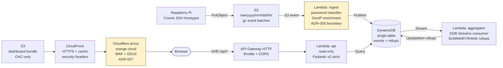

# SOC Detection Lab — Honeypot Visualizer Dashboard

**Capstone narrative.** ~5 min read. Pairs with [PROJECT_PLAN.md](PROJECT_PLAN.md) (full design) and the per-phase logs.

## What this is

A live, public-read-only dashboard that visualizes SSH-honeypot login attempts in near-real time. A Cowrie honeypot ships gzipped event batches to S3; a serverless ingest pipeline writes them into a single-table DynamoDB design; a thin API Lambda fronts a React + Recharts SPA. Built end-to-end on AWS in ~3 weeks of evening/weekend work, deliberately under a $5/month additive cost budget.

- **Live:** <https://dashboard.dram-soc.org>
- **GitHub:** <https://github.com/dram64/soc-detection-lab>
- **Pairs with:** Diamond IQ (separate detection-engineering portfolio piece)

## Architecture

**Two security boundaries are explicit:**

- **ADR-005 — `password_raw`.** The ingest Lambda derives a `password` (dictionary-classified) from the captured plaintext, but `password_raw` never leaves the ingest path's private write side. The API Lambda's read path uses a Pydantic model with `extra="forbid"` and no `password_raw` field; a CloudWatch metric filter alarms if the literal string ever appears in the API log group.
- **ADR-007 — Cloudflare proxy as edge.** Public traffic terminates at Cloudflare (free WAF, DDoS, bot management) and is proxied to CloudFront. CloudFront's S3 origin is locked down with an OAC. AWS WAF is intentionally *not* used (~$5.40/mo savings; ADR-007 details the trade).

## Phases shipped

| # | Phase | What landed |
|---|---|---|
| 1 | Bootstrap + ADRs | Terraform skeleton, single-table DDB schema, ADR-001/003/004/005/007/009. |
| 2 | Ingest Lambda | S3-event → password classifier → DDB write, with Pydantic models, GeoLite2 enrichment, DLQ, password-leak alarm. |
| 3 | Aggregator Lambda | DDB-Streams consumer producing SUMMARY/RANK rollups; idempotent via `DEDUP#STREAM` sentinel. |
| 4 | API Lambda + HTTP API GW | 8 read routes, 4 latency-tier acceptance bars, fan-out fix from 702 ms → ~40 ms on `/api/summary`, parallel boto3 Client. |
| 5 | Frontend scaffold | Vite + React 18 + TS strict + TanStack Query v5 + Tailwind dark theme, "silent stale data" UX pattern. |
| 6 | P1 visualizations | Counter row, top-attackers/usernames/passwords, timeline AreaChart, recent-events virtualized table. |
| 7 | GeoMap | Choropleth (`react-simple-maps` + `world-atlas` + ISO alpha-2 ↔ numeric), synthetic-distribution path A, lazy-loaded chunk. |
| 8 | Production hosting | ACM cert (DNS), S3 + CloudFront with OAC, response headers policy (CSP/HSTS/etc.), Cloudflare proxied DNS, $10 billing alarm, deploy script. |

## Architectural fixes caught and resolved

| Fix | What it was | How it was caught | Resolution |
|---|---|---|---|
| **Reserved Concurrency floor** | First Phase 2 apply errored: `UnreservedConcurrentExecution below minimum 10`. Account is at the AWS quota floor of 10 concurrent executions; no per-function reservation will fit. | Live `terraform apply` failure. | All `reserved_concurrent_executions` arguments **deleted** (not zeroed). Cost-defense moved up to API GW throttling + invocation-rate alarms. PROJECT_PLAN v1.3. |
| **Generator non-determinism** | Phase 2 idempotency test counted 5000 → 10000 on replay. The generator anchored timestamps to `datetime.now()`, so same-`--seed` reruns produced legitimately *new* events. | Live idempotency acceptance test. | Added `--anchor-time` flag with explicit precedence. Property test asserts byte-equal output between two seeded runs. PROJECT_PLAN v1.4. |
| **Aggregator Bug 1 — fan-out per query** | `/api/summary` p95 ~702 ms; 30 SUMMARY#DAY rollup rows queried for one answer. | Phase 4 latency benchmark missed the < 100 ms bar. | Replaced fan-out with a single `SUMMARY#OVERVIEW` rollup row. p95 dropped to ~40 ms. PROJECT_PLAN v1.5. |
| **Aggregator Bug 2 — boto3 Resource not thread-safe** | Parallelized fan-out endpoints crashed under load. | Phase 4 stress test. | Switched parallel paths to thread-safe boto3 `Client` + 25-conn pool + 10-worker executor. Latency bars on `/api/timeline` + `/api/breakdown` revised to < 600 ms (measured 423–493 ms). PROJECT_PLAN v1.5. |
| **Stream-record idempotency** | A retried Streams batch could double-count rollups. | Code review during Phase 3. | `DEDUP#STREAM` sentinel item per stream record id. Replay → conditional-write rejection → no double-increment. |
| **Synthetic enrichment ingest gate** | Phase 7 generator added `country/asn/asn_org` fields, but `CowrieEvent.model_validate` is `extra="forbid"` and rejected them. | Local pytest run before deploy. | Pop enrichment fields before validation; prefer source enrichment over MaxMind. Required a Phase 7 ingest Lambda redeploy (deviation from "no terraform" Phase 7 prompt, approved). |
| **API `rstrip("s")` plural collapse** | `"countries".rstrip("s") = "countrie"` — `/api/top/countries` silently returned empty. Latent from Phase 4. | Phase 7 live verification (data didn't show up after deploy). | Replaced with explicit `DIMENSION_BY_ROUTE = {"usernames":"username","passwords":"password","countries":"country"}`. Regression test added. |
| **ACM validation 60-min timeout** | First Phase 8 `terraform apply -auto-approve` errored after 60 min: validation CNAME never resolved. | Apply error + `nslookup` against `1.1.1.1`/`8.8.8.8`. | Triaged: record was missing from Cloudflare DNS. After re-add, `apply` re-run resumed cleanly in 8 min. No state drift. |

## PROJECT_PLAN amendments (v1.0 → v1.5)

The plan changed five times under contact with reality. Headlines:

- **v1.1** — Removed AWS WAF; switched Cloudflare proxy ON. ADR-005 (password) and ADR-007 (Cloudflare WAF) added. Cost model went $8 → $2.60/mo. Phase 8.5 (apex landing page) added; Phase 11 (real-data tuning buffer) added.
- **v1.2** — Reserved Concurrency revised (`ingest=20, aggregator=5, api=20` → all `=5`). Diamond IQ already reserved enough of the 1000-default account quota that 20 didn't fit.
- **v1.3** — Reserved Concurrency removed entirely. Account is at the 10-unit quota floor; no per-function reservation can fit until a service-quota-increase ticket lands. Cost defense moved to upstream layers (API GW + alarms).
- **v1.4** — Generator determinism contract written. `--anchor-time` flag + property test enforce byte-equal seeded reruns.
- **v1.5** — Phase 4 latency bars reality-checked. Fan-out fix (Bug 1) + thread-safe Client (Bug 2) landed; remaining floor is Pydantic+boto3 mechanics, not a design problem. CloudFront caching (Phase 8) is the last-mile mitigation for real users.

The plan didn't drift; it ratcheted. Each amendment names the discrepancy, the diagnosis, and the resulting decision.

## Deferred decisions

- **Per-function Reserved Concurrency.** Deferred until an account-level concurrency-quota increase is granted. Cost defense covered by API GW throttling + invocation-rate alarms.
- **Mobile CLS polish.** Lighthouse mobile Performance lands at 84 (desktop is 100). The hit is `cumulative-layout-shift = 0.281` from chart-skeleton → Recharts handoff. Deferred to Phase 9 (a small CSS change reserving fixed heights on chart wrappers).
- **Cloudflare Web Analytics integration.** The CSP `script-src 'self'` blocks the auto-injected beacon. Decision: keep CSP strict; CloudWatch + RUM in Phase 9 will provide the same visibility.
- **`/api/*` through CloudFront.** Frontend hard-codes `VITE_API_BASE_URL`. Single-origin would be cleaner but adds a CloudFront behavior + cache rules + WAF surface for marginal benefit on a 30s-refresh dashboard. Phase 9+ may revisit.
- **CSP `style-src 'unsafe-inline'`.** Carried for Tailwind runtime style injection. If tightened in a future phase, validate via `Content-Security-Policy-Report-Only` first.
- **CloudFront access logging.** Skipped in Phase 8; Phase 9 sets up observability properly with structured CloudWatch and a CUR-style cost dashboard.

## What's left

- **Phase 8.5** — Apex `dram-soc.org` static landing page (separate distribution behavior, same bucket via `/apex/` prefix; ACM SAN extension; Cloudflare apex CNAME-flatten).
- **Phase 9** — Observability + cost guards (CloudWatch dashboard, viral-traffic runbook, heartbeat alarm in DISABLED state until Pi cutover).
- **Phase 10** — Pi cutover (primary path) or Fallback A (VPS reverse-tunnel) or Fallback B (indefinite synthetic). Build readiness ≠ deployment decision.
- **Phase 11** — Real-data tuning buffer (3–5 days, only fires post-cutover).

## Cost

Steady-state run rate after Phase 8: **~$2.60/month**, against a $50/month account cap. Phase 8 incremental was ~$0.11/mo (mostly the billing alarm itself). The largest line items are CloudWatch logs (~$0.50) and DynamoDB on-demand reads from the API Lambda. ACM is free, S3 is rounding error, CloudFront stays inside the free tier at recruiter-traffic volumes.
